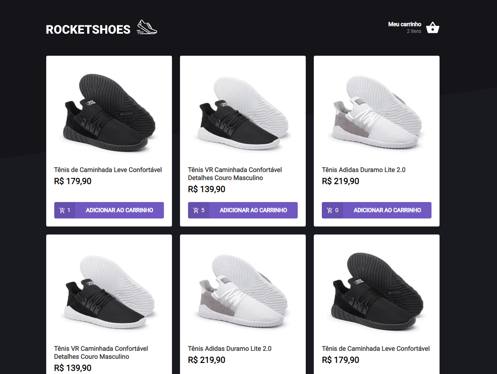
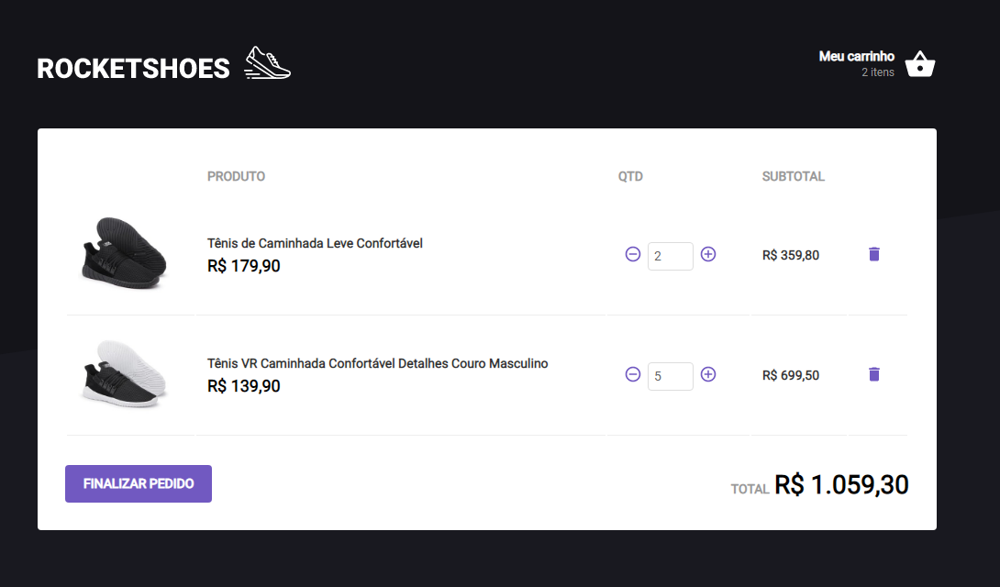

# Rocketshoes

# <p><h2 align="center">Application that simulates an online store with shopping cart. Developed in Ignite's second module delivered by [Rocketseat](https://app.rocketseat.com.br/dashboard)</h2> </p>

### 🎲 Running application

```bash
# Clone this repository
$ git clone https://github.com/FilipeRK/Ignite-Challenge03-Rocketshoes.git

# Access the project folder in the / cmd terminal. Example:
$ cd Ignite-Challenge03-Rocketshoes

# Install the dependencies
$ yarn

# Run fakeAPI, which will run on the path: http://localhost:3333
$ yarn server

# Run the application, which will run on the path http://localhost:3000
$ yarn start
```

# Pictures of running application 
### Main screen



### Cart



#

### 🛠 Technologies used

- [React.js](https://pt-br.reactjs.org/)
- [TypeScript](https://www.typescriptlang.org/)
- [Axios](https://github.com/axios/axios)
- [Styled-Components](https://styled-components.com/)
- [Polished](https://polished.js.org/)
- [React-Icon](https://react-icons.github.io/react-icons/)
- [Toastify](https://github.com/fkhadra/react-toastify)
- [Json-Server](https://github.com/typicode/json-server)


<br />
<p >Developed by <a href="https://github.com/FilipeRK">Filipe Kohls </a>